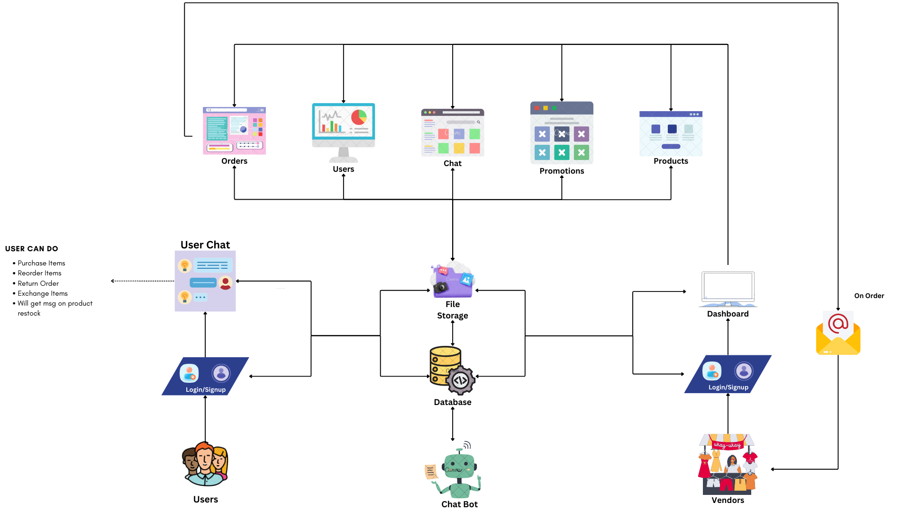

# Deedx-Baratheon-Hackathon

## Introduction

In this project we will allow you to connect your whatsapp with your chatbot.

## Architecture Diagram

## Schema Diagram

- [Schema](https://lucid.app/lucidchart/5395f824-da3f-4df7-bf44-49a4c1200f66/edit?invitationId=inv_a72362cf-b225-48fd-937a-7cc32b35013b&page=0_0#)

## 🎉 Release Status

Version - v
Initial release date -
[View all releases]()

## 🍃 Branches

Source Code

- [main]() - Stable and latest version of the source code
- [1.0.0]() - Stable 1.0.0 version of the source code
- [1.1.x]() - Unstable and development versions of the source code

## 💙 Built With

- [Python](https://www.python.org/)
- [React](https://react.dev/)

## 📌 Prerequisites

## 💡 How to Setup

- Download or clone the repository.
- Move the project to the selected directory.
- Open it with a code editor.

## 🚀 How to Run

- Run in development mode "uvicorn main:app --reload".

## 💎 Dependencies

- [PostgreSQL](https://www.postgresql.org/)

## ❤️ Thanks

Thanks to everyone who supported.

## 👨‍💻 Developed By

XLoop Digital
[©xloopdigital.com](https://xloopdigital.com)

## 💬 Contact

Send us an email if you need to contact us to discuss anything.
Email - <sales@xloopdigital.com>
